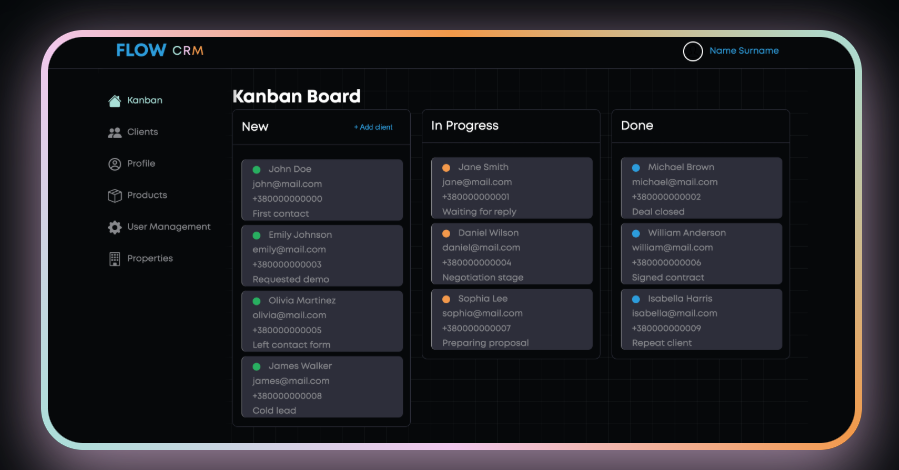
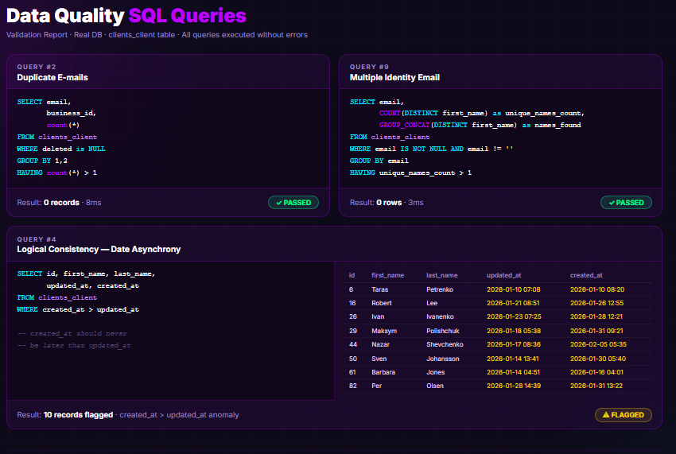
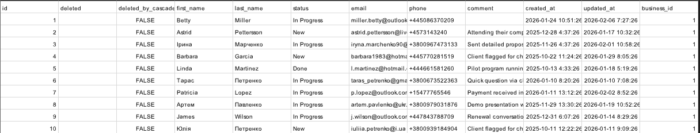
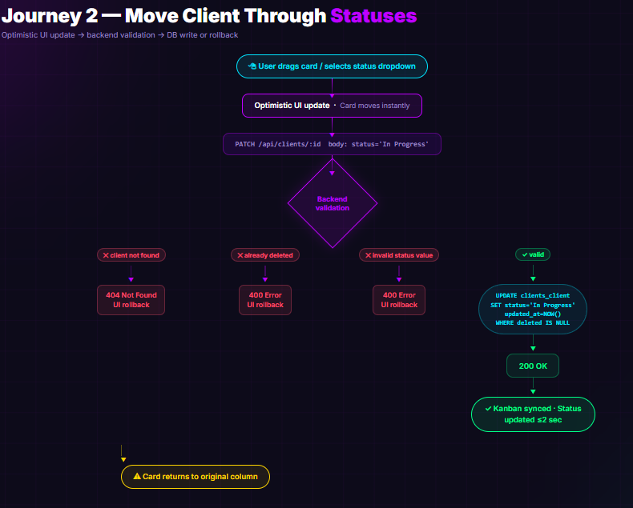
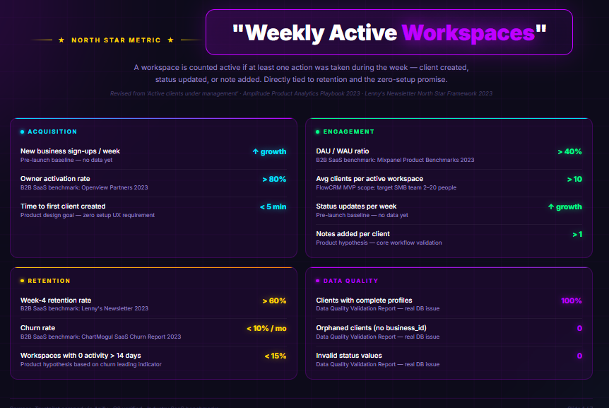
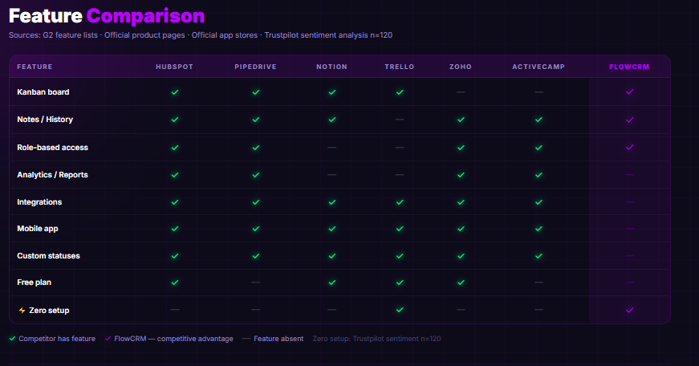
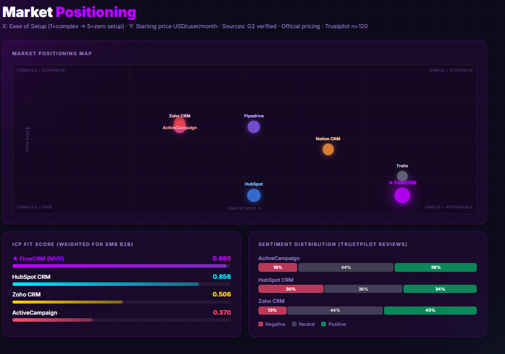
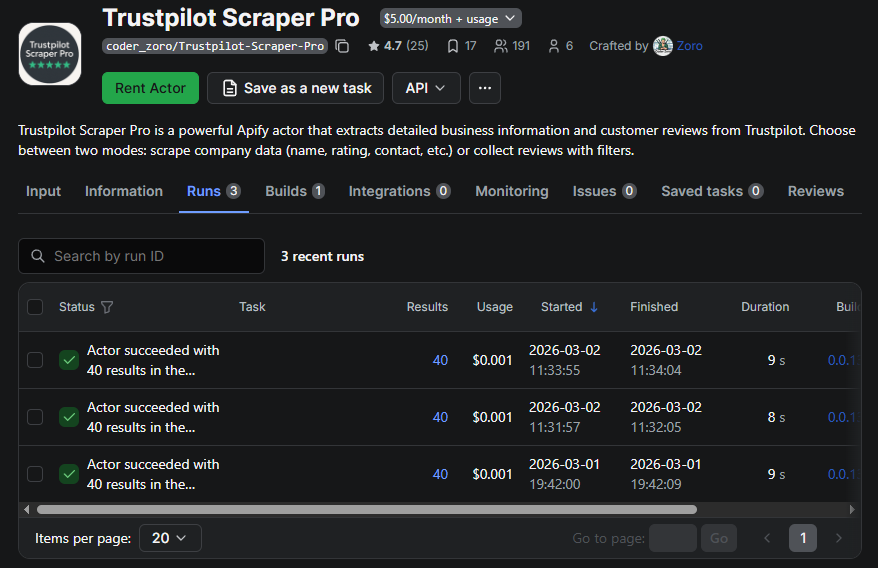

# FlowCRM — Product Analytics & Product Market Fit Repository

> Product analytics and market fit artifacts created alongside FLOW_CRM -
> a lightweight B2B CRM for small teams (2–20 people).



4-week cross-functional product sprint with full role coverage:
- Frontend Developers
- Product Manager
- QA Engineer
- Product / Data Analyst
  
End-to-end product cycle: 
> discovery → DB design → QA → market fit analysis → KPI framework
---

## Repository Structure

```
flowcrm-product-analytics/
├── 01_database/
│   ├── er-diagram/
│   └── data-dictionary/
├── 02_data-quality/
│   ├── standards-v1.0.md
│   └── validation-report.md
├── 03_test-dataset/
│   ├── flow_crm_clients.csv        ← 120 client records
│   └── dataset-spec.md
├── 04_user-journeys/
│   ├── journey-1-create-client.md
│   ├── journey-2-move-status.md
│   ├── journey-3-add-comment.md
│   └── journey-4-soft-delete.md
├── 05_competitive-analysis/
│   ├── benchmark-dashboard.html
│   └── icp-fit-score-model.md
├── 06_kpi-tree/
│   └── metrics-tree.md
└── README.md
```

---

## Completed Work

### 01 · Database Documentation

- ER Diagram: 6 core tables, all relationships (1:1, 1:Many, Many:Many)
- Data Dictionary: 10 sheets, complete field specs, constraints, business logic
  

### 02 · Data Quality

- **Standards v1.0** - 5 quality dimensions: Completeness, Uniqueness, Validity, Referential Integrity, Consistency
- **Validation Report** - 10 SQL queries executed against live DB
  - ✅ 5 PASSED · ❌ 5 FAILED
  - Critical finding: 120 orphaned records → escalated to backend
  - Logical paradox: 13 records with `created_at > updated_at`



### 03 · Test Dataset

- 120 client records in CSV format, ready for import
- Status distribution: 30% New · 50% In Progress · 20% Done
- 20+ edge cases: long names, special characters, phone format variants, empty optional fields
- 50+ notes distributed across clients



### 04 · User Journey Data Flow

- 4 journeys mapped with flow diagrams and DB operations
- Journey 1: Create New Client (INSERT)
- Journey 2: Move Client Through Statuses (UPDATE)
- Journey 3: Add Comment to Client (UPDATE)
- Journey 4: Soft Delete Client (UPDATE soft delete)
- Each journey includes: steps → API request → backend validation → DB operation → edge cases




### 05 · Product Metrics & Benchmarking

- North Star Metric: Weekly Active Workspaces
- Acquisition · Engagement · Retention · Data Quality metrics with targets
- Interactive Metrics Tree visualization
  



  
### 05 · Competitive analysis & Market positioning

- 7 competitors benchmarked: HubSpot, Zoho, ActiveCampaign, Pipedrive, Notion CRM, Trello, FlowCRM

  

- ICP Fit Score model (weighted): Ease of Setup 30% · Kanban 25% · G2 Rating 20% · Free Plan 15% · Price 10%
- Market Positioning Map

  

- Data sources: Trustpilot (Apify scrape, n=40/company), G2 (manual), NLP sentiment classifier

  


---

## Tech Stack Used

- SQL
- Python
- HTML/JS
- Apify
- DB Browser for SQLite
- Google Sheets

---

## Key Findings

- FlowCRM ICP Fit Score: **0.980** vs HubSpot: **0.856** (closest competitor)
- Critical DB issue identified: orphaned clients blocked by FK constraints → required backend fix
- Positioning: "Simple + Affordable" quadrant - uncontested by major competitors

---
> ### **FOCAL POINT**:
> FlowCRM score based on product specification assumptions, not verified market data and real users trafic
>
> **Score will be recalculated post-launch with real G2 data**

---

## Related
- Product repository: [FLOW_CRM](https://github.com/Vitalii20296/FLOW_CRM) by Vitalii Hulaievych & Oleh
